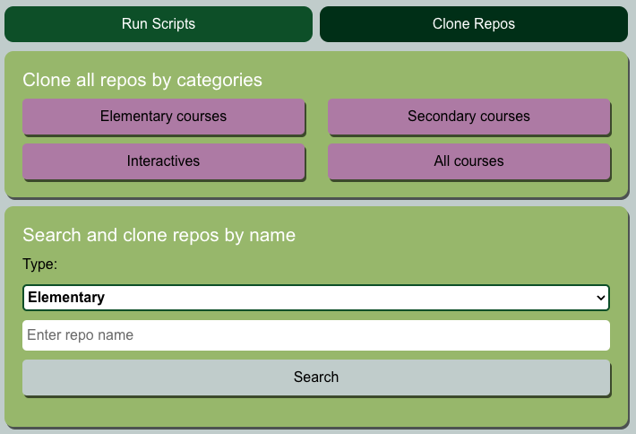

# Repository Automation App

## Overview  
Desktop application that allows running multiple scripts on one or more repository courses synchronously. At the moment, this App can only run on elementary course repos.

## Table of Contents   
* [Features](#Features)
* [Installation](#Installation)
* [How to run scripts with the App](#How-to-run-scripts-with-the-App)
* [How to clone repos with the App](#How-to-clone-repos-with-the-App)

* [Available scripts](#Available-scripts)
* [Credits](#Credits)
* [License](#License)
* [Questions](#Questions)

## Features
* Check if GitLab.com is online
* Search and select multiple repos
* Pull selected repos
* Push selected repos
* Rebuild k8 css and vendor.min files
* Add `"department" : "elem"` in `.json` files located in **widgets** folder
* Clone selected repos

## Computer requirements to use App
* Node 16 version
* Access to gitlab interactive ILO
* Gitlab access token on .npmrc file setup for @tvontario
* Internet connection with access to gitlab.com

## Installation
1. Clone the repo.
2. Navigate to the project directory.
3. Run command `npm install` to install any dependencies.
4. Run command `npm run pack-win` (for Windows OS) or `npm run pack-mac` (for MacOS).
5. Install App
    
    **For Windows**: Go to repository-automation/dist and double click **Repository Automation Setup x.x.x.exe**
    
    **For MacOS**: Go to repository-automation/dist/mac and double click **RepositoryAutomation.app**

## How to run scripts with the App 
1. Launch the App.

2. Verify location of course repos is correct on the User Data sectiop. Otherwise select the correct folder. 
    **Note:** Gitlab token is not needed to run scripts.

3. Select one or more tasks to perform.

4. Click on **More info** tab to discover detailed explanation of each task.

5. Select one or more repos to execute the previous selected tasks.

6. Click **RUN** button once ready. 

    **Note**: RUN button is only clickable when the following criterias are meet:
    * Computer can access GitLab. This will be indicated with a green cloud icon on the top right corner beside GitLab
    * A tasks is selected
    * A repo is selected
    * There is a commit message (Only when Push to Gitlab is selected)
    

7. Check the progress on the automation. Allow notifications for this App on computer settings to receive updates via push notifications.

    **Note:** If needed, press "Cancel" button to stop automation.

## How to clone repos with the App
1. Launch the App.

2. Verify that both location of course repos and Gitlab tokken are correct are correct on the User Data sectiop. Otherwise select the correct folder and enter your Gitlab token. 

3. Use dropdown and searchbar to search for repos by name.
    **Note: There are 4 clone actions available as well. Some of those option will clone more than 100 repos.

4. Select a repo type and enter name to narrow down the search. Press "Search" or "return" key

5. Select one or more repos to clone.

6. Click **Clone** button to start cloning. 

    There will be a prompt to confirm cloning when repos selected are more than 10.

7. Check the progress on the cloning progress. Allow notifications for this App on computer settings to receive updates via push notifications.

    **Note:** If needed, press "Cancel" button to stop automation.

8. Once it finished cloning. Press on "Close" button to return to main menu.

## Available scripts
In the project directory, you can run:

### `npm run dev`
Runs the app in the development mode.\
Open **http://localhost:3000** to view it in an instance of Chromium browser that comes Electron.

The page will reload when you make changes.\

### `npm run pack-mac`
Builds the app for production to the `build` folder.\
Package the app for MacOS in the `dist` folder.\

### `npm run pack-win`
Builds the app for production to the `build` folder.\
Package the app for Windows in the `dist` folder.\

### `npm run pack-linux`
Builds the app for production to the `build` folder.\
Package the app for Linux in the `dist` folder.\

## Credits  
Developed by: 
Manuel Leung Chen ([GitHub](https://github.com/manuelleungchen))

Tools used to develop this application: 
* [Bootstrap](https://getbootstrap.com)
* [Electron](https://www.electronjs.org)
* [Node.js](https://nodejs.org/en/)
* [React.js](https://reactjs.org/)

Dev Dependencies:
* [Bootstrap](https://www.npmjs.com/package/bootstrap)
* [Concurrently](https://www.npmjs.com/package/concurrently)
* [Electron](https://www.npmjs.com/package/electron)
* [Electron-Builder](https://www.npmjs.com/package/electron-builder)
* [React](https://www.npmjs.com/package/react)
* [React-Markdown](https://www.npmjs.com/package/react-markdown)
* [Fix-path](https://www.npmjs.com/package/fix-path)

## License
Copyright (c) 2020 - Manuel Leung Chen

Licensed under the [MIT License](https://choosealicense.com/licenses/mit/).

## Questions
Manuel Leung Chen - [GitHub](https://github.com/manuelleungchen )

If you have any question about this application, please reach out me by [Email](manuel.leungchen@gmail.com)