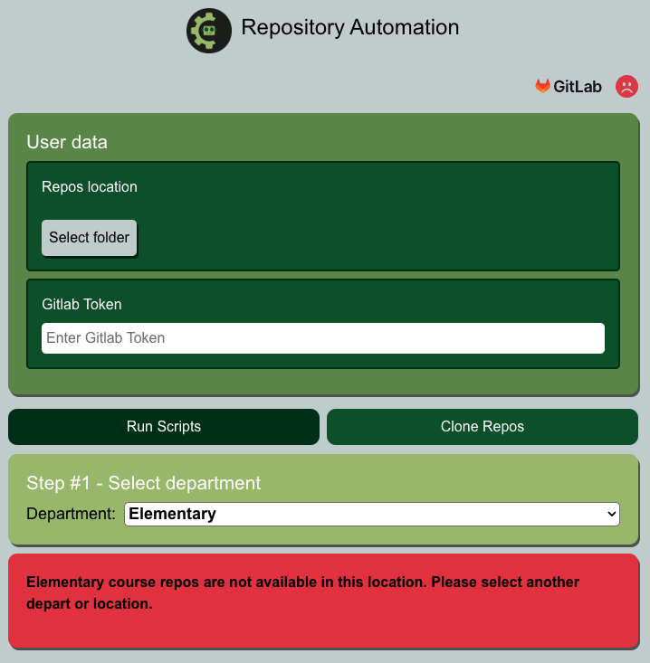
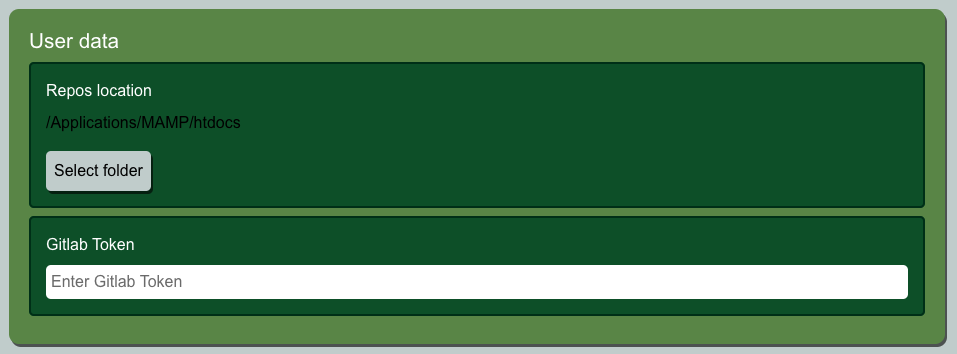
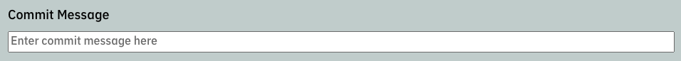

# Repository Automation App


## Overview  
Desktop application that allows running multiple scripts on one or more repository courses synchronously. At the moment, this App can only run on elementary course repos.



## Table of Contents   
* [Features](#Features)
* [Installation](#Installation)
* [How to use the App ](#How-to-use-the-App)
* [Available scripts](#Available-scripts)
* [Credits](#Credits)
* [License](#License)
* [Questions](#Questions)

## Features
* Detect if GitLab is online
* Search and select multiple repos
* Pull selected repos
* Push selected repos
* Rebuild k8 css and vendor.min files
* Add `"department" : "elem"` in `.json` files located in **widgets** folder

## Installation
1. Clone the repo.
2. Navigate to the project directory.
3. Run command ```npm install``` to install any dependencies.

## How to use the App    
1. Launch the App.
2. Verify location of course repos is correct. Otherwise select the correct folder.

3. Select one or more actions to perform.

4. Click on **More info** tab to discover detailed explanation of each action.

5. Select one or more repos to execute the previous selected actions.

6. Click **Start** button once ready. If the button is the clickable, verify that your computer can access GitLab. This will be indicated with a green cloud icon on the top right corner.

7. Check the progress on the automation. Allow notifications for this App to receive updates via push notifications.


## Available scripts
In the project directory, you can run:

### `npm run dev`
Runs the app in the development mode.\
Open **http://localhost:3000** to view it in an instance of Chromium browser that comes Electron.

The page will reload when you make changes.\

### `npm run pack-mac`
Builds the app for production to the `build` folder.\
Package the app for MacOS in the `dist` folder.\

### `npm run pack-win`
Builds the app for production to the `build` folder.\
Package the app for Windows in the `dist` folder.\

### `npm run pack-linux`
Builds the app for production to the `build` folder.\
Package the app for Linux in the `dist` folder.\

## Credits  
Developed by: 
Manuel Leung Chen ([GitHub](https://github.com/manuelleungchen))

Tools used to develop this application: 
* [Bootstrap](https://getbootstrap.com)
* [Electron](https://www.electronjs.org)
* [Node.js](https://nodejs.org/en/)
* [React.js](https://reactjs.org/)

Dev Dependencies:
* [Bootstrap](https://www.npmjs.com/package/bootstrap)
* [Concurrently](https://www.npmjs.com/package/concurrently)
* [Electron](https://www.npmjs.com/package/electron)
* [Electron-Builder](https://www.npmjs.com/package/electron-builder)
* [React](https://www.npmjs.com/package/react)
* [React-Markdown](https://www.npmjs.com/package/react-markdown)
* [Fix-path](https://www.npmjs.com/package/fix-path)

## License
Copyright (c) 2020 - Manuel Leung Chen

Licensed under the [MIT License](https://choosealicense.com/licenses/mit/).

## Questions
Manuel Leung Chen - [GitHub](https://github.com/manuelleungchen )

If you have any question about this application, please reach out me by [Email](manuel.leungchen@gmail.com)